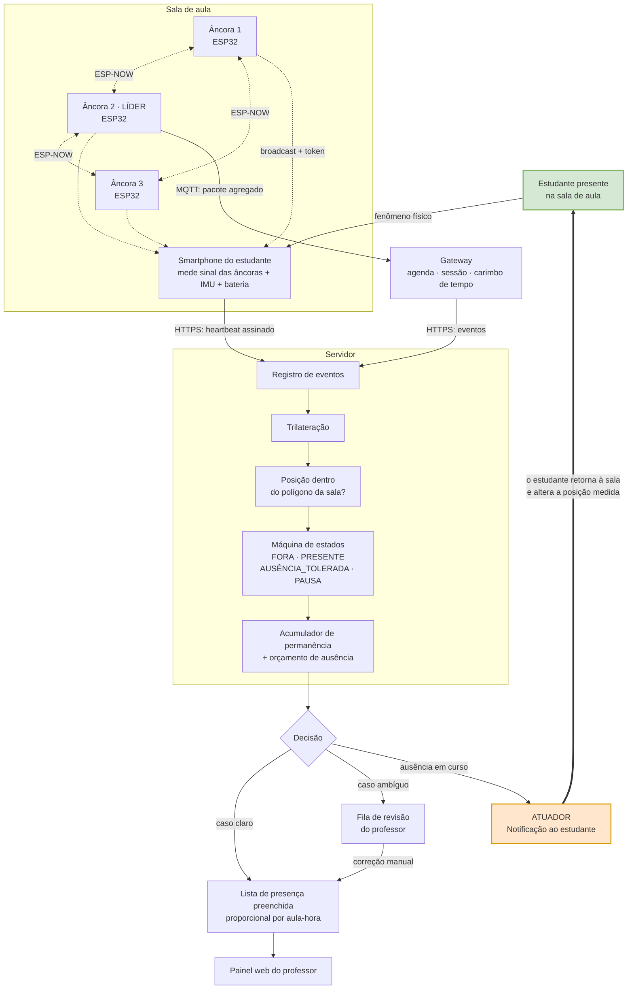

# Atividade em Grupo 01 — Análise inicial de um sistema ubíquo

**Universidade Federal de Goiás — Instituto de Informática**
**Software para Sistemas Ubíquos — Prof. Dr. Otávio Calaça Xavier**

## Integrantes

| Nome | Matrícula |
|---|---|
| Alany Gabrielly | 202105018 |
| *(preencher)* | |
| *(preencher)* | |
| *(preencher)* | |

## Cenário escolhido

### Presença — registro automático e proporcional de frequência em sala de aula

O sistema detecta a permanência física do estudante na sala durante a janela da aula e
**devolve ao professor a lista de presença já preenchida**, sem que ele tenha executado
a chamada. Ao estudante, avisa em tempo hábil quando uma ausência em curso está prestes
a lhe custar presença.

O cenário é uma variação do exemplo "sala de aula inteligente" sugerido no enunciado,
recortado para o eixo de **ocupação** — e é a proposta que o grupo pretende levar ao
projeto final.

---

# Parte 1 — Compreensão do problema

## 1. Problema e usuários

### O problema

A chamada é um ritual que consome tempo de aula, produz um dado de baixa qualidade e
ainda assim é obrigatório por exigência legal (75% de frequência).

Três defeitos concretos do processo atual:

- **Custo de tempo.** Entre 5 e 10 minutos por aula. Numa disciplina de 32 encontros,
  são de 3 a 5 horas-aula gastas em tarefa administrativa.
- **Baixa fidelidade.** O registro é feito uma única vez, num instante arbitrário da
  aula. Quem chega depois da chamada consta ausente; quem responde e vai embora em
  seguida consta presente. O dado descreve um instante, não a aula.
- **Fraude trivial.** Responder pelo colega não tem custo nem risco.

O sistema proposto substitui o instante por **tempo de permanência acumulado**, medido
continuamente e sem ação de ninguém.

### Usuários

| Usuário | Papel | O que ganha |
|---|---|---|
| **Professor** | Primário | Recupera o tempo de aula, deixa de ser operador do sistema e passa a ser apenas revisor de exceções |
| **Estudante** | Primário | Registro justo e proporcional; não é interrompido; presença deixa de depender de estar presente no instante da chamada |
| **Coordenação / Secretaria** | Secundário | Frequência auditável, com histórico do porquê de cada decisão |

### Situação de uso

Sala de aula presencial convencional, aulas de 50 minutos frequentemente geminadas,
com intervalo programado entre elas. O sistema opera **apenas dentro da janela da
aula** e permanece inerte no restante do dia.

## 2. Contexto a ser percebido

### Contexto do usuário

- **Identidade** — qual estudante corresponde a qual dispositivo.
- **Posição** — o estudante está dentro ou fora do polígono da sala.
- **Permanência** — quanto tempo acumulou dentro, e em que trechos esteve fora.
- **Vivacidade** — há uma pessoa com o aparelho, ou o aparelho está abandonado sobre
  a mesa? Percebida por movimento.
- **Estado do dispositivo** — nível de bateria e conectividade, para distinguir
  *"o estudante saiu"* de *"o celular morreu"*.

### Contexto do ambiente

- **Qual sala** e qual a geometria dela (o polígono contra o qual a posição é testada).
- **Quais âncoras** cobrem aquela sala e se estão operacionais.
- **Obstrução e ocupação** — corpos entre o aparelho e a âncora atenuam o sinal e
  degradam a estimativa de posição.

### Contexto do sistema

- **Agenda acadêmica** — horário de início, de fim e do intervalo; a qual turma e a
  qual disciplina aquela sessão pertence.
- **Estado da sessão** — aberta, em pausa programada ou encerrada.
- **Saúde da infraestrutura** — âncoras respondendo, conectividade com o servidor.

> A distinção que mais importa no projeto: **ausência programada** (o intervalo, que
> vale para a turma inteira) e **ausência não programada** (o estudante saiu por conta
> própria). São percebidas pelo mesmo sensor e tratadas por regras opostas.

## 3. Dispositivos e comunicação

| Dispositivo | Quantidade | Papel |
|---|---|---|
| **Âncora ESP32** | 3 por sala | Fixa na parede, energizada pela rede elétrica. Transmite continuamente um sinal identificado e um token rotativo. **Nunca escuta os aparelhos dos estudantes** — conversa apenas com as âncoras vizinhas, em malha. |
| **Smartphone do estudante** | 1 por aluno | Executa o aplicativo. Ouve as três âncoras, mede a intensidade de sinal de cada uma, lê o próprio acelerômetro e reporta ao servidor. |
| **Gateway da sala/prédio** | 1 | Concentra as âncoras via MQTT, guarda a agenda, abre e fecha as sessões, carimba o tempo oficial. |
| **Servidor de aplicação** | 1 | Trilateração, máquina de estados, banco de dados, verificação criptográfica. |
| **Painel web do professor** | — | Consulta e revisão de exceções. Navegador, sem instalação. |

### Como trocam informação

```
Âncoras  ──broadcast de rádio──▶  Smartphone       (sem identificação, sem retorno)
Âncora ◀──ESP-NOW (malha)──────▶  Âncora           (medições, eleição de líder)
Líder    ──MQTT sobre Wi-Fi────▶  Gateway          (pacote agregado das 3)
Gateway  ──MQTT────────────────▶  Líder            (abrir/encerrar sessão)
Smartphone ──HTTPS/TLS─────────▶  Servidor         (heartbeat assinado)
Gateway  ──HTTPS───────────────▶  Servidor         (eventos e carimbo de tempo)
Navegador ──HTTPS──────────────▶  Servidor         (painel do professor)
```

### Duas decisões de projeto na camada de comunicação

**A âncora é um farol.** Ela transmite para o vazio e não recebe nada dos aparelhos.
Quem mede o sinal é o smartphone, e quem recebe a identidade é o servidor, por canal
cifrado. **A âncora nunca sabe quem está na sala.** Se for arrancada da parede e tiver a
memória extraída, não revela nenhum dado de estudante.

**As âncoras da sala formam uma malha.** Em vez de as três se associarem ao Wi-Fi
institucional, elas conversam entre si por **ESP-NOW** — protocolo sem conexão da
Espressif, que dispensa ponto de acesso — e elegem uma líder, que é a única a falar com
o gateway. Quatro consequências:

| Consequência | Efeito |
|---|---|
| **Comunicação multi-salto** | Sala com cobertura ruim de Wi-Fi continua operando: as âncoras do fundo transmitem através da âncora líder |
| **Carga no ponto de acesso reduzida a um terço** | Um prédio de 60 salas deixa de ter 180 clientes Wi-Fi e passa a ter 60 |
| **Auto-organização** | As âncoras se descobrem e elegem a líder. Se a líder falhar, outra assume sem intervenção humana |
| **Agregação na rede** | A líder funde as três medições num único pacote, em vez de três mensagens independentes ao gateway |

## 4. Processamento e resposta

O processamento é **distribuído em três níveis**, cada um com o que lhe cabe:

### Na borda — âncora ESP32

Gera o token rotativo (HMAC sobre um contador de tempo, renovado a cada 10–15 s) e
publica seu próprio estado de saúde. Não processa nada sobre pessoas.

### Na borda — smartphone

Mede a intensidade de sinal das três âncoras, calcula a variância do acelerômetro na
janela, assina o pacote com a chave privada guardada no hardware seguro do aparelho e
mantém uma fila local quando não há conectividade.

### No núcleo — servidor

Onde mora a inteligência do sistema:

1. **Trilateração** — converte três intensidades de sinal em uma posição estimada.
2. **Teste de pertinência** — a posição está dentro do polígono da sala?
3. **Máquina de estados** — `FORA` / `PRESENTE` / `AUSÊNCIA_TOLERADA` / `PAUSA_PROGRAMADA`.
4. **Acumulação** — soma o tempo em `PRESENTE`, aplicando o orçamento de ausência.
5. **Discretização** — converte o tempo contínuo em presença por aula-hora.

> O acumulador **não é incrementado em tempo real**: a permanência é uma função
> calculada sobre o registro de eventos ao final da sessão. Só assim é possível
> reprocessar retroativamente quando se descobre, dez minutos depois, que a ausência
> começou antes.

### Resposta produzida

O produto final do sistema é **a lista de presença preenchida e entregue ao professor**,
sem que ele tenha executado a chamada. Além dela, o sistema produz duas respostas ativas:

| Resposta | Destinatário | Natureza |
|---|---|---|
| **Lista de presença preenchida** | Professor | Registro — o entregável do sistema |
| **Fila de revisão de exceções** | Professor | Registro — casos que o sistema não soube decidir |
| **Aviso de ausência em curso** | Estudante | **Atuação** — provoca mudança no mundo físico |

O **aviso ao estudante** é a resposta mais importante do ponto de vista da modelagem,
porque é a única que realimenta o fenômeno observado:

> *"Você está fora da sala há 25 minutos. Restam 5 minutos do seu limite; depois disso
> o tempo para de ser contabilizado."*

O aviso precisa chegar **enquanto ainda há o que fazer**. Uma notificação enviada depois
de a falta estar consolidada é apenas informação; enviada antes, é atuação — ela muda a
decisão do estudante, que retorna à sala e altera a própria posição, que é exatamente a
grandeza que o sistema mede.

## 5. Risco principal

### Privacidade — e o paradoxo que ela expõe

O risco principal é de **privacidade**, e não pela razão óbvia. Não é o volume de dado
coletado: o sistema guarda pouca coisa, e a posição é relativa à sala, não ao planeta.

O risco está em um subproduto que o sistema **não precisa, mas obtém de graça**: o
registro contínuo de posição dentro da sala produz, sem esforço, o **grafo de
colocalização** — quem senta perto de quem, ao longo de todo o semestre. Esse grafo
revela vínculos sociais que nenhum estudante consentiu em declarar, e é bem mais
sensível que a frequência em si.

**Mitigações adotadas:**

- Sensoriamento restrito à janela da aula; fora dela, o sistema é inerte.
- A âncora não recebe identidade; ela trafega apenas entre aparelho e servidor, cifrada.
- O registro bruto de eventos tem retenção curta (dias); só o agregado por aula-hora
  persiste.
- O grafo de colocalização nunca é materializado nem persistido.
- O estudante consente uma vez, explicitamente, e pode desinstalar.
- **O sistema é transparente para quem ele mede.** O aviso de ausência em curso informa
  o estudante da decisão *antes* que ela se consolide. Ele não é julgado em silêncio:
  sabe o que o sistema está medindo, quando está medindo e qual será a consequência,
  com tempo hábil de reagir. Isso converte vigilância em acordo.

### O compromisso de fundo

Vale registrar a tensão que o grupo identificou, porque ela não tem solução técnica:

> **Neste domínio, ubiquidade e privacidade são grandezas inversas.**

As versões *mais* ubíquas deste sistema são exatamente as que exigem menos do
estudante — e exigir menos significa retirar a participação dele. Um sistema
perfeitamente invisível de controle de presença seria reconhecimento facial por câmera,
ou sensor de pressão no piso: o ambiente reconheceria a pessoa sem aplicativo, sem
bateria, sem cooperação. Ubiquidade máxima, consentimento zero.

O aplicativo que o estudante instala e a leitura de código que ele faz uma vez são
justamente o que "suja" a ubiquidade do sistema — e é também o que **preserva a agência
dele**. A escolha do grupo foi deliberadamente não maximizar a ubiquidade.

### Riscos secundários

- **Confiabilidade sob adversário.** Diferente da maioria dos sistemas ubíquos, os
  usuários deste têm incentivo alinhado para derrotá-lo: toda a turma se beneficia de
  marcar um colega ausente como presente. Metade do esforço de projeto existe por causa
  disso (token rotativo, orçamento de ausência, detecção de aparelho imóvel).
- **Energia.** O sistema transfere custo de bateria para o aparelho do estudante — que
  é justamente o dispositivo que o projeto não controla.
- **Dependência de dispositivo pessoal.** A bateria do celular do estudante passa a ser
  pré-requisito do histórico escolar dele. Daí a necessidade da fila de revisão manual.

---

# Parte 2 — Modelagem do sistema

## 6. Sensores, atuadores e gateway

### Sensores

| Sensor | Onde | Fenômeno que capta | Para que serve |
|---|---|---|---|
| **Receptor de rádio** (medição de intensidade de sinal) | Smartphone | Atenuação do sinal das 3 âncoras com a distância | Estimar a posição por trilateração |
| **Acelerômetro (IMU)** | Smartphone | Micromovimento do aparelho | Distinguir aparelho com dono de aparelho abandonado |
| **Medidor de bateria** | Smartphone | Nível e curva de descarga | Distinguir "saiu da sala" de "celular desligou" |
| **Câmera** | Smartphone | Leitura do código de pareamento | Vincular pessoa e chave — **uma única vez por semestre** |
| **Relógio + agenda** | Gateway | Contexto temporal | Delimitar sessão, início, fim e intervalo |

> Observação relevante para a disciplina: **o sensor principal não está no ambiente,
> está no bolso do usuário.** O ambiente fornece apenas as referências fixas (as
> âncoras). Essa inversão é o que permite o sistema funcionar sem instalar câmeras ou
> leitores, e é também o que o torna dependente da cooperação mínima do estudante.

### Atuadores

O sistema não aciona motor, relé nem válvula — mas **possui atuação, e ela alcança o
mundo físico**. O atuador é a notificação; o **efetuador é o próprio estudante**.

| Atuador | Atua sobre | Efeito |
|---|---|---|
| **Notificação de ausência em curso** | O estudante | Ele retorna à sala — **muda a posição física, que é a grandeza medida** |
| **Notificação de encerramento** | O estudante | Informa a permanência acumulada na aula |
| **Lista de presença preenchida** | O processo administrativo | Substitui a chamada; o professor deixa de executá-la |
| **Fila de revisão** | O professor | Convoca decisão humana onde a automática não basta |
| **Comando de sessão (`iniciar`/`encerrar`)** | As próprias âncoras | O sistema reconfigura a própria infraestrutura conforme a agenda |

#### Por que isso caracteriza atuação e não apenas saída de dados

A distinção está em **haver ou não realimentação sobre o fenômeno observado**:

```
mede posição → decide que haverá falta → avisa o estudante →
        o estudante caminha de volta → a posição muda → mede posição
```

O anel se fecha sobre a mesma variável que entrou. O elo humano substitui o motor, mas
a topologia do laço é a de um sistema de controle. Na literatura, isso é um
**sistema ciber-físico com humano no laço** (*human-in-the-loop CPS*): o ser humano não
é apenas usuário do sistema, é um de seus componentes de atuação.

#### Política de notificação

O aviso só atua se chegar **enquanto ainda cabe reação**. Daí a política:

| Momento | Aviso |
|---|---|
| 10 min de ausência (metade do orçamento) | *"Fora da sala há 10 min. Seu limite é de 15 min nesta aula."* |
| 13 min (limite iminente) | *"Faltam 2 min do seu limite. Depois disso o tempo para de contar."* |
| Limite esgotado | *"O tempo parou de ser contabilizado às 10h42."* |
| Fim da aula | *"Você acumulou 78% desta aula."* |

Nada é notificado fora desses quatro momentos. Aviso que não admite reação é ruído, e
ruído contradiz o princípio de tecnologia calma que orienta o projeto.

### Gateway

O gateway é a fronteira entre a sala e a rede. Suas funções:

1. **Concentração** — recebe da âncora líder, por MQTT, o pacote já agregado das três
   âncoras da sala. Não fala com cada âncora individualmente.
2. **Tradução de protocolo** — MQTT na sala, HTTPS para o servidor.
3. **Controle de sessão** — consulta a agenda e publica `sessão/iniciar` cinco minutos
   antes da aula e `sessão/encerrar` ao final. Fora disso, as âncoras não sensoriam.
4. **Fonte de verdade temporal** — carimba os eventos com relógio confiável. O tempo
   informado por um nó nunca é aceito como verdade.
5. **Amortecimento** — enfileira eventos quando a internet cai e reenvia depois.

## 7. Fluxo do sistema

### Forma linear (conforme o modelo do enunciado)

```
Fenômeno físico        O estudante está fisicamente dentro da sala
       ↓
Sensor                 Smartphone mede a intensidade do sinal das 3 âncoras
                       e a variância do próprio acelerômetro
       ↓
Comunicação/Gateway    Heartbeat assinado por HTTPS ao servidor;
                       âncoras reportam saúde por MQTT ao gateway,
                       que carimba o tempo oficial
       ↓
Processamento          Trilateração → posição estimada
                       Teste de pertinência ao polígono da sala
                       Máquina de estados de permanência
       ↓
Decisão                Conta o tempo? Congela? Tolera a ausência?
                       Manda para revisão humana? Avisa o estudante?
       ↓
Resposta/Atuador       Lista de presença preenchida ao professor
                       + fila de exceções
                       + NOTIFICAÇÃO AO ESTUDANTE  ──┐
       ↓                                             │
Realimentação          O estudante retorna à sala ───┘
                       e altera a posição medida
```

O último passo é o que distingue este sistema de um mero registrador: a resposta
**volta ao fenômeno**. O estudante avisado de que perderá presença retorna à sala, e
a grandeza medida no primeiro passo se altera por ação do próprio sistema.

### Diagrama



A seta em destaque é o **laço de realimentação**: sem ela o sistema apenas observaria;
com ela, ele participa do fenômeno que mede.

## 8. Classificação

O sistema admite mais de uma classificação, com pesos diferentes:

### Aplicação ubíqua — classificação principal ✅

É a caracterização que melhor descreve o sistema, por quatro atributos:

- **Interação implícita.** Após um único pareamento no início do semestre, o estudante
  não executa nenhuma ação em cerca de vinte aulas. A presença é subproduto de estar na
  sala, não uma tarefa.
- **Ciência de contexto multidimensional.** O comportamento depende de lugar, tempo,
  identidade e atividade simultaneamente.
- **Infraestrutura embarcada e invisível.** As âncoras ficam na parede, sem interface,
  sem manutenção e sem que ninguém pense nelas.
- **Proatividade.** O sistema decide e registra sem ser acionado.

**Ressalva honesta:** por ser construído sobre smartphone — dispositivo de propósito
geral que disputa atenção —, o sistema se enquadra com mais precisão no ramo da
**computação pervasiva/móvel** do que no ideal de *calm technology* de Weiser, que
previa muitos dispositivos especializados e nenhum aparelho a carregar.

### Internet das Coisas (IoT) ✅

Plenamente aplicável: dispositivos endereçáveis e conectados à internet, telemetria
publicada por protocolo próprio de IoT (MQTT), processamento em servidor remoto e
gateway como ponte entre a rede local e a nuvem.

### Rede de sensores ✅ caracterizada

Quatro argumentos sustentam o enquadramento:

**1. Medição cooperativa.** O traço mais definidor de uma rede de sensores é produzir
uma grandeza que **nenhum nó isolado produz**. Uma âncora sozinha fornece uma distância
inútil; as três juntas fornecem uma posição. Isso é fusão de dados, não coleta paralela.

**2. Localização baseada em âncoras.** O sistema implementa um problema canônico da
área: **nós-âncora** (*anchor nodes*) de posição conhecida permitem que um nó de posição
desconhecida se localize por intensidade de sinal. O termo "âncora", usado ao longo deste
documento, é o vocabulário próprio da literatura de redes de sensores.

**3. Nó móvel em campo de âncoras fixas.** O smartphone do estudante é um **nó móvel**
que se desloca por um campo de nós estáticos. Redes de sensores com nós móveis são uma
configuração padrão, não uma exceção.

**4. Escala de implantação.** A rede não tem três nós: tem **três por sala**. Um prédio
com 60 salas opera 180 nós sensores sob a mesma infraestrutura, com multi-salto,
auto-organização, eleição de líder e agregação na rede.

> **Ressalva honesta.** Um traço clássico não se aplica: **energia não é a restrição
> dominante**, porque as âncoras estão na rede elétrica. Em redes de sensores autônomas,
> o projeto inteiro gira em torno de sobreviver com bateria. Isso aproxima o sistema de
> uma rede de sensores **infraestruturada** mais que de uma WSN autônoma clássica. O
> grupo optou por não alimentar as âncoras a bateria apenas para satisfazer o critério
> — seria degradar o sistema de propósito.

### Sistema ciber-físico ✅ caracterizado, com humano no laço

Um sistema ciber-físico exige **laço fechado** entre computação e mundo físico: medir,
decidir e **atuar sobre o fenômeno medido**. O sistema cumpre os três:

| Etapa | No sistema Presença |
|---|---|
| **Medir** | Posição do estudante na sala, por trilateração |
| **Decidir** | A ausência em curso consumirá o orçamento e custará presença |
| **Atuar** | Notificação: *"você está fora há 25 minutos e vai perder presença"* |
| **Realimentar** | O estudante retorna — **a posição medida se altera** |

A variável que sai do laço é a mesma que entrou. O que substitui o motor é o **elo
humano**: o atuador é a notificação e o efetuador é o próprio estudante. Na literatura,
isso constitui um **sistema ciber-físico com humano no laço** (*human-in-the-loop CPS*),
categoria em que a pessoa não é apenas usuária, mas **componente de atuação** do sistema.

> **Ressalva para a defesa.** Uma leitura estrita de CPS exige atuação sobre processos
> físicos sem mediação humana — por essa régua, o sistema não se qualificaria. O grupo
> adota a leitura com humano no laço, e a justificativa é que a topologia de controle é
> idêntica: há realimentação negativa sobre a grandeza medida, com atraso, histerese e
> possibilidade de o laço não convergir (o estudante pode ignorar o aviso). A diferença
> em relação a um atuador mecânico é a **confiabilidade do efetuador**, não a estrutura
> do laço.

## 9. Contexto e adaptação

Sete mudanças de contexto que alteram o comportamento do sistema:

| Mudança de contexto | Adaptação do sistema |
|---|---|
| **Entra o intervalo programado** | O acumulador congela para a turma inteira. Ausência deixa de ser avaliada — ninguém precisa estar em lugar nenhum. |
| **Estudante sai do polígono** | Estado passa a `AUSÊNCIA_TOLERADA`. Se voltar em até 10 minutos e permanecer, o tempo é creditado; caso contrário, o acumulador congela **retroativamente** ao início real da ausência. |
| **Ausência atinge metade do orçamento** | O sistema **atua**: notifica o estudante de que a falta está em curso e quanto tempo resta. É a adaptação mais importante do sistema, porque é a única que realimenta o fenômeno observado. |
| **Estudante retorna após o aviso** | O laço convergiu. O acumulador volta a correr e o sistema silencia — não há mais nada a notificar. |
| **Estudante ignora o aviso** | O laço não convergiu. O sistema não insiste: emite o aviso final de encerramento e para. Insistir seria ruído, e o sistema não tem autoridade sobre a decisão do estudante. |
| **Orçamento de 15 min esgotado** | Novas ausências deixam de ser creditadas e passam a descontar diretamente. O perdão é um orçamento por sessão, não por evento. |
| **Bateria crítica ou sumiço abrupto do sinal** | Estado `SINAL_PERDIDO`. O sistema **não pune automaticamente** — encaminha para revisão do professor. A curva de descarga é verificada para detectar quem informa bateria falsa. |
| **Aparelho imóvel a aula inteira** | Variância de acelerômetro próxima de zero indica aparelho possivelmente emprestado. Marca para revisão, sem decidir sozinho. |
| **Perda de conectividade na sala** | O aplicativo passa a armazenar localmente e reenvia quando a rede voltar (*store-and-forward*). A aula é reconstruída depois, sem perda. |
| **Âncora líder falha** | As âncoras restantes detectam a ausência na malha ESP-NOW e **elegem uma nova líder**, que assume a comunicação com o gateway. Reorganização automática, sem intervenção humana e sem perda de sessão. |
| **Âncora fora do ar** | O sistema degrada de trilateração (posição) para proximidade simples (distância a um ponto), registra a sessão como de precisão reduzida e avisa a manutenção. Degradação graciosa em vez de falha total. |
| **Fora da janela de aula** | Sensoriamento desligado no aplicativo e nas âncoras — por economia de energia e por limitação de finalidade. |
| **Aula cancelada ou trocada de sala** | O gateway simplesmente não abre a sessão, ou abre na sala nova. A agenda é a fonte de verdade; nenhuma reconfiguração manual de dispositivo é necessária. |

---

## Decisão principal de projeto

*(para a apresentação de dois minutos)*

**Trocar "presença" por "permanência".**

O sistema não responde *"o estudante estava presente?"* — pergunta binária, avaliada num
instante arbitrário. Ele responde *"quanto tempo o estudante permaneceu?"* — grandeza
contínua, acumulada ao longo de toda a aula.

Três consequências decorrem dessa única decisão:

1. **O professor sai do laço.** Não existe mais o instante da chamada, logo não existe
   mais quem a conduza. As âncoras ficam na parede e a agenda abre a sessão sozinha.
2. **O erro do sistema deixa de ser catastrófico.** Numa presença binária, três minutos
   de falha de sensor custam a aula inteira. Com permanência acumulada, custam três
   minutos. O erro passa a ser proporcional à falha.
3. **A ubiquidade deixa de ser retórica.** Sem o instante da chamada, não sobra nenhum
   ritual para o estudante executar — e a tarefa administrativa desaparece de fato, que
   é o critério de Weiser.
4. **O sistema ganha como avisar antes de punir.** Só quem mede continuamente pode dizer
   *"faltam 2 minutos do seu limite"*. Numa chamada binária não existe "em curso": ou já
   faltou, ou não. É a medição contínua que torna possível a notificação — e é a
   notificação que fecha o laço e transforma um registrador passivo em sistema
   ciber-físico.

---

## Observações sobre a continuidade

Conforme a orientação do enunciado, esta é uma hipótese inicial e poderá ser revista.
Os pontos que o grupo já identificou como abertos:

- **Precisão da trilateração.** A intensidade de sinal de rádio tem erro de vários
  metros e não respeita paredes. Três âncoras melhoram muito, mas o limiar precisa ser
  calibrado empiricamente na sala real, em dBm, não em metros.
- **Empréstimo de aparelho.** Nenhuma quantidade de âncoras resolve — o aparelho está
  genuinamente na sala. Só se mitiga por vivacidade (acelerômetro) e verificação humana.
- **Execução em segundo plano.** Android e iOS tratam isso de formas incompatíveis: o
  primeiro admite serviço em primeiro plano com notificação persistente; o segundo só
  admite despertar por evento de região. O modelo de amostragem precisa ser orientado a
  eventos para funcionar nos dois.
