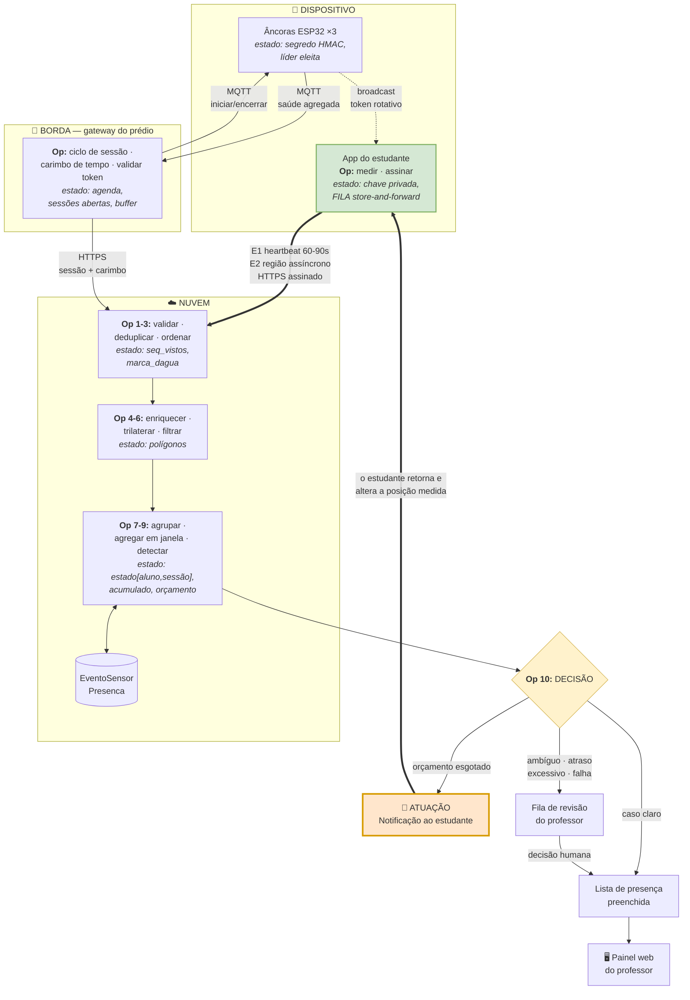

# Atividade em Grupo 02 — Processamento e distribuição de responsabilidades

**Universidade Federal de Goiás — Instituto de Informática**
**Software para Sistemas Ubíquos — Prof. Dr. Otávio Calaça Xavier**

## Integrantes

| Nome | Matrícula |
|---|---|
| Alany Gabrielly | 202105018 |

## Cenário

**Presença** — registro automático e proporcional de frequência em sala de aula, por
medição da permanência física do estudante durante a janela da aula. Cenário analisado
na [Atividade 01](atividade-01.md).

### Ajuste incorporado desde a Atividade 01

A Atividade 01 definiu **dois** limites para a mesma grandeza: tolerância de 10 minutos
por ausência e orçamento de 15 minutos por sessão. Eram redundantes e conflitantes — a
própria notificação especificada (*"fora há 10 min, seu limite é de 15"*) só faz sentido
se o limite for o orçamento.

**Mantém-se apenas o orçamento de 15 minutos por sessão.** Os avisos aos 10 e 13 minutos
passam a corresponder a 2/3 e 87 % do limite, e o congelamento ocorre aos 15. A
requalificação de `min(30 min, tempo restante)` permanece, pois cumpre função distinta:
impedir que o estudante reabra crédito apenas reaparecendo por alguns segundos.

---

# Parte 1 — Eventos do sistema

## 1. Tipos de evento

Os dois eventos são produzidos **pelo mesmo dispositivo** — o aplicativo do estudante —
mas representam ocorrências de naturezas opostas:

| Evento | Natureza | Origem da ocorrência |
|---|---|---|
| `presenca.heartbeat.v1` | **Periódico** — amostragem contínua | Temporizador do aplicativo |
| `presenca.regiao.v1` | **Assíncrono** — travessia de fronteira | Interrupção do sistema operacional |

A distinção não é cosmética: ela decorre de uma restrição real de plataforma. No Android,
um *Foreground Service* permite amostrar a cada 60–90 s, produzindo `heartbeat`. No iOS
não existe temporizador em segundo plano — o sistema **acorda o aplicativo** na entrada e
na saída de uma região monitorada, produzindo `regiao`. O sistema precisa decidir
corretamente recebendo ora um fluxo denso, ora apenas dois eventos por aula.

## 2. Contrato dos eventos

### E1 — `presenca.heartbeat.v1`

| Atributo | Valor |
|---|---|
| **Nome** | `presenca.heartbeat.v1` |
| **Produtor** | `app-aluno`, instância identificada pela chave pública pareada |
| **Entidade observada** | O estudante dentro de uma sessão de aula (`aluno` × `sessao`) |
| **Tempo do evento** | `ts_evento` — instante da medição **no aparelho**, ISO 8601 UTC com milissegundos |
| **Identificação** | `id_evento` (UUIDv4) + `seq` (contador monotônico por sessão, inicia em 1) |

| Campo | Tipo | Unidade | Descrição |
|---|---|---|---|
| `sessao` | string | — | Nonce da sessão de aula |
| `aluno` | string | — | Token opaco do estudante |
| `ts_evento` | timestamp | UTC ms | Instante da medição |
| `seq` | inteiro | — | Sequência monotônica por sessão |
| `ancoras[].id` | string | — | Identificador da âncora ouvida |
| `ancoras[].rssi` | inteiro | **dBm** | Intensidade recebida, faixa física −100 a 0 |
| `ancoras[].token` | string | — | Token rotativo ouvido, prova de recepção |
| `imu.variancia` | decimal | **(m/s²)²** | Variância do acelerômetro na janela |
| `bateria.nivel` | inteiro | **%** | Carga restante |
| `bateria.carregando` | booleano | — | Ligado à tomada |
| `assinatura` | string | base64 | Ed25519 sobre os demais campos |

### E2 — `presenca.regiao.v1`

| Atributo | Valor |
|---|---|
| **Nome** | `presenca.regiao.v1` |
| **Produtor** | `app-aluno`, mesma instância |
| **Entidade observada** | A fronteira da sala (`sala`) atravessada pelo estudante |
| **Tempo do evento** | `ts_evento` — instante da travessia **detectada pelo sistema operacional**, que pode anteceder a entrega em minutos |
| **Identificação** | `id_evento` (UUIDv4) + `seq`, **na mesma sequência de E1** |

| Campo | Tipo | Unidade | Descrição |
|---|---|---|---|
| `sessao` | string | — | Nonce da sessão |
| `aluno` | string | — | Token opaco |
| `ts_evento` | timestamp | UTC ms | Instante da travessia |
| `seq` | inteiro | — | Sequência compartilhada com E1 |
| `sala` | string | — | Sala cuja fronteira foi cruzada |
| `transicao` | enum | — | `entrada` \| `saida` |
| `origem` | enum | — | `ios_regiao` \| `android_scan` |
| `rssi_ultimo` | inteiro | **dBm** | Última medição antes da travessia |
| `ts_entrega` | timestamp | UTC ms | Quando o aparelho conseguiu enviar |
| `assinatura` | string | base64 | Ed25519 |

> **Decisão de contrato:** `seq` é **única e compartilhada** pelos dois tipos dentro de
> uma sessão. Isso estabelece ordem total entre eventos de naturezas diferentes e permite
> detectar lacunas — se chegam `seq` 7 e 9, o evento 8 existe e está pendente, mesmo sem
> saber de que tipo ele é.

## 3. Exemplos

### `presenca.heartbeat.v1`

```json
{
  "tipo": "presenca.heartbeat.v1",
  "id_evento": "9f2c41a8-6b7e-4c3d-8a11-2e5f0d7b93c4",
  "sessao": "s-2026-09-23-INF0285-T02",
  "aluno": "tok_a41f9c2e",
  "ts_evento": "2026-09-23T13:42:17.480Z",
  "seq": 37,
  "ancoras": [
    { "id": "anc-204-A", "rssi": -68, "token": "3f9a1c" },
    { "id": "anc-204-B", "rssi": -81, "token": "3f9a1c" },
    { "id": "anc-204-C", "rssi": -77, "token": "3f9a1c" }
  ],
  "imu": { "variancia": 0.042 },
  "bateria": { "nivel": 63, "carregando": false },
  "assinatura": "MEUCIQDf...8rLQ=="
}
```

### `presenca.regiao.v1`

```json
{
  "tipo": "presenca.regiao.v1",
  "id_evento": "c07b5e19-3a44-4f8b-91d2-6c8e2a0f5b71",
  "sessao": "s-2026-09-23-INF0285-T02",
  "aluno": "tok_a41f9c2e",
  "ts_evento": "2026-09-23T13:51:02.115Z",
  "ts_entrega": "2026-09-23T13:53:40.902Z",
  "seq": 38,
  "sala": "sala-204",
  "transicao": "saida",
  "origem": "ios_regiao",
  "rssi_ultimo": -88,
  "assinatura": "MEQCIF2n...pQ7w=="
}
```

> Repare na diferença de **2 min 38 s** entre `ts_evento` e `ts_entrega` no segundo
> exemplo. Não é defeito: é o comportamento normal do iOS ao acordar um aplicativo
> suspenso. É exatamente o caso tratado no item 8.

## 4. Qualidade dos dados

### Validação necessária: prova de recepção do token da âncora

A validação indispensável é verificar que `ancoras[].token` corresponde a um token
emitido por aquela âncora **na janela de tempo do evento**. O token rotaciona a cada
10–15 s e não é previsível; devolvê-lo prova que o aparelho estava no alcance do rádio.

Sem essa validação, todo o sistema cai: qualquer estudante poderia fabricar valores de
RSSI de casa e declarar-se presente. É a única validação que liga o dado a um fato
físico.

### Reconhecimento de eventos problemáticos

| Situação | Como é reconhecida | Ação |
|---|---|---|
| **Inválido — assinatura** | `assinatura` não confere com a chave pública ativa do estudante | Descarta e registra tentativa |
| **Inválido — token** | `token` não consta entre os emitidos pela âncora em `ts_evento ± 30 s` | Descarta |
| **Inválido — faixa física** | Algum `rssi` fora de −100..0 dBm, ou `imu.variancia` negativa | Descarta |
| **Inválido — relógio** | \|`ts_evento` − relógio do servidor\| > 2 min **e** o evento não está marcado como bufferizado | Descarta |
| **Inválido — contexto** | `sessao` não está aberta, ou o estudante não está matriculado na turma | Descarta |
| **Duplicado** | O par (`aluno`, `sessao`, `seq`) já foi processado | Ignora silenciosamente — reenvio é comportamento esperado de quem tem rede ruim |
| **Desatualizado** | `ts_evento` anterior à marca d'água da sessão | **Não descarta** — segue para o tratamento do item 8 |

> **Princípio adotado:** descarte silencioso apenas para duplicado; descarte com registro
> para inválido; **nunca descarte para atrasado**. Evento atrasado é dado bom que chegou
> tarde, e punir o estudante por atraso de rede seria transferir a ele uma falha da
> infraestrutura.

---

# Parte 2 — Processamento temporal

## 5. Operações

```
                                    ┌─────────────────────────────┐
  E1 heartbeat  ──┐                 │  estado por (aluno, sessão) │
  E2 região     ──┤                 └──────────────┬──────────────┘
                  │                                │
                  ▼                                ▼
         ┌─────────────────┐              ┌──────────────────┐
         │ 1. VALIDAÇÃO    │  assinatura, token, faixa,      │
         │                 │  relógio, sessão aberta         │
         └────────┬────────┘                                 │
                  ▼                                          │
         ┌─────────────────┐                                 │
         │ 2. DEDUPLICAÇÃO │  chave (aluno, sessão, seq)     │
         └────────┬────────┘                                 │
                  ▼                                          │
         ┌─────────────────┐                                 │
         │ 3. ORDENAÇÃO    │  marca d'água; desvia atrasados │
         └────────┬────────┘                                 │
                  ▼                                          │
         ┌─────────────────┐                                 │
         │ 4. ENRIQUECIMTO │  junta com agenda: turma,       │
         │                 │  polígono da sala, intervalo    │
         └────────┬────────┘                                 │
                  ▼                                          │
         ┌─────────────────┐                                 │
         │ 5. TRANSFORMAÇÃO│  3×RSSI → distâncias →          │
         │                 │  trilateração → posição         │
         └────────┬────────┘                                 │
                  ▼                                          │
         ┌─────────────────┐                                 │
         │ 6. FILTRAGEM    │  descarta posição com resíduo   │
         │                 │  de trilateração alto           │
         └────────┬────────┘                                 │
                  ▼                                          │
         ┌─────────────────┐                                 │
         │ 7. AGRUPAMENTO  │  por (aluno, sessão)            │
         └────────┬────────┘                                 │
                  ▼                                          │
         ┌─────────────────┐                                 │
         │ 8. AGREGAÇÃO    │◀────── lê e atualiza ───────────┘
         │    EM JANELA    │  janela de sessão da ausência
         └────────┬────────┘
                  ▼
         ┌─────────────────┐
         │ 9. DETECÇÃO     │  regra do item 9
         └────────┬────────┘
                  ▼
         ┌─────────────────┐
         │ 10. ATUAÇÃO     │  notificação ao estudante
         │                 │  + registro de frequência
         └─────────────────┘
```

## 6. Estado e janela

### A regra

> **Uma ausência não programada consumiu todo o orçamento de 15 minutos da sessão.**
> Congelar o acumulador retroativamente ao início real da ausência e notificar o
> estudante.

A regra depende de eventos anteriores em dois níveis: precisa do **instante em que a
ausência começou** (evento passado) e do **orçamento já consumido em ausências
anteriores** da mesma aula.

### Janelas

São duas, encaixadas:

| Janela | Tipo | Duração | Função |
|---|---|---|---|
| **Debounce** | Deslizante | 30 s | Confirmar que a queda de sinal é real e não ruído. Só há transição de estado se a condição se sustentar por toda a janela |
| **Ausência** | **Janela de sessão** (*session window*) | Variável, teto de 15 min | Abre no evento de saída, fecha no de retorno. Sua duração é a grandeza avaliada |

A janela de ausência é do tipo **sessão** — e não fixa nem deslizante — porque seu início
e fim são definidos por eventos, não pelo relógio. É o tipo correto para intervalos de
inatividade de duração desconhecida.

### Frequência de avaliação

**A cada evento recebido, e adicionalmente a cada 60 segundos por temporizador.**

O temporizador não é redundância. A regra dispara pela **ausência de eventos** — um
estudante que saiu da sala e desligou o aparelho para de produzir dados justamente
quando a decisão precisa ser tomada. Uma avaliação puramente orientada a evento nunca
concluiria que se passaram 15 minutos, porque nenhum evento chegaria para informá-lo.

### Estado mantido, por `(aluno, sessao)`

| Campo | Para quê |
|---|---|
| `estado` | `FORA` \| `PRESENTE` \| `AUSENCIA_TOLERADA` \| `PAUSA_PROGRAMADA` |
| `ts_mudanca` | Instante da última transição |
| `acumulado_ms` | Permanência somada até aqui |
| `orcamento_restante_ms` | Do total de 15 min da sessão |
| `ts_inicio_ausencia` | Início **real** da ausência corrente, para o estorno retroativo |
| `credito_provisorio_ms` | Ausência creditada aguardando requalificação |
| `marca_dagua` | Maior `ts_evento` visto, menos a tolerância de atraso |
| `seq_vistos` | Conjunto para deduplicação |
| `avisos_enviados` | Quais notificações já foram emitidas, para não repetir |

## 7. Semântica temporal

**A regra usa o tempo do evento** (`ts_evento`), com uma exceção deliberada.

### Por que tempo do evento

1. **O aparelho bufferiza quando perde rede.** Com tempo de processamento, uma aula
   inteira reconstruída após a reconexão apareceria comprimida no instante em que a rede
   voltou — o estudante teria ficado "presente" por dois segundos.
2. **O iOS entrega eventos de região com atraso do sistema operacional**, às vezes de
   minutos. O instante que interessa é o da travessia, não o do despertar do aplicativo.
3. **A permanência é grandeza física medida no aparelho.** Ela ocorre na sala, não no
   servidor.

### A exceção: o disparo do temporizador usa tempo de processamento

A avaliação periódica de 60 s pergunta *"já se passaram 15 minutos sem sinal?"*, e essa
pergunta não pode esperar um evento que talvez nunca chegue. Ela é necessariamente
ancorada no relógio do servidor.

**Consequência assumida:** uma decisão tomada por temporizador é **provisória**. Se
depois chegarem eventos atrasados mostrando que o estudante estava na sala, ela é
revista — o que o item 8 detalha.

### Confiança no relógio do aparelho

`ts_evento` vem do aparelho, que é controlado por quem pode querer fraudar. Portanto:

- eventos em tempo real são rejeitados se divergirem mais de **2 minutos** do relógio do
  servidor;
- eventos marcados como bufferizados escapam dessa checagem, mas ficam limitados pela
  sequência `seq` — não é possível inserir um evento entre dois já processados;
- **o carimbo de tempo do gateway é a fonte de verdade** para os limites da sessão.

## 8. Eventos atrasados

**Política adotada: corrigir, com separação nos casos extremos. Nunca descartar.**

Essa escolha decorre de uma decisão já tomada no projeto: a permanência **não é um
contador incrementado ao vivo**, é uma função calculada sobre o registro de eventos.
Recalcular é, portanto, a operação natural — e barata.

| Atraso do evento | Tratamento |
|---|---|
| **≤ 5 min** (dentro da tolerância) | **Aceitar e reprocessar.** A janela afetada é recalculada e o resultado corrigido. Se houve notificação indevida, envia-se retificação |
| **> 5 min, sessão ainda aberta** | **Aceitar em trilha separada.** Grava-se o evento, recalcula-se, e a `Presenca` é marcada como *recalculada*. Se a frequência mudou, entra na fila de revisão do professor |
| **Após o encerramento contábil da sessão** | **Separar.** Não altera o registro automaticamente; vira pendência de revisão manual, com o antes e o depois visíveis ao professor |
| **Sessão de outro dia** | **Separar e alertar.** Atraso dessa ordem indica defeito ou manipulação, não rede ruim |

### Marca d'água

Por `(aluno, sessao)`:

```
marca_dagua = max(ts_evento já visto) − 5 min
```

Um evento com `ts_evento < marca_dagua` é atrasado. A tolerância de 5 minutos foi
escolhida para cobrir o atraso típico de despertar do iOS (observado em torno de 2 a 3
minutos) com folga.

### Por que não descartar

Descartar o atrasado transferiria ao estudante o custo de uma falha de infraestrutura:
quem está na sala com sinal ruim seria penalizado, e quem está em casa com boa conexão
não. Seria punir exatamente quem cumpriu a obrigação.

## 9. Pseudocódigo da regra

```
CONSTANTES
  RSSI_ENTRA          = -70 dBm
  RSSI_SAI            = -85 dBm
  DEBOUNCE            = 30 s
  ORCAMENTO_SESSAO    = 15 min
  AVISO_1             = 10 min      // 2/3 do orçamento
  AVISO_2             = 13 min      // 87% do orçamento
  ATRASO_TOLERADO     = 5 min
  DESVIO_RELOGIO_MAX  = 2 min
  REQUALIFICACAO      = min(30 min, tempo restante da aula)

ESTADO e[aluno, sessao]:
  estado, ts_mudanca, acumulado, orcamento_restante,
  ts_inicio_ausencia, credito_provisorio,
  marca_dagua, seq_vistos, avisos_enviados


// ─────────── ENTRADA DE EVENTO ───────────
AO RECEBER evento v:

  // validade
  SE NÃO assinatura_confere(v, chave_ativa(v.aluno))     → DESCARTA("assinatura")
  SE (v.aluno, v.sessao, v.seq) ∈ e.seq_vistos           → IGNORA("duplicado")
  SE NÃO sessao_aberta(v.sessao, v.ts_evento)            → DESCARTA("fora da sessão")
  SE v.tipo = heartbeat:
      SE ∃ a ∈ v.ancoras : NÃO token_emitido(a.id, a.token, v.ts_evento ± 30 s)
                                                          → DESCARTA("token")
      SE ∃ a ∈ v.ancoras : a.rssi ∉ [-100, 0]            → DESCARTA("faixa")
  SE NÃO v.bufferizado E |v.ts_evento − agora()| > DESVIO_RELOGIO_MAX
                                                          → DESCARTA("relógio")

  registra_evento(v)
  e.seq_vistos ← e.seq_vistos ∪ {v.seq}

  // atraso
  SE v.ts_evento < e.marca_dagua:
      SE (e.marca_dagua − v.ts_evento) ≤ ATRASO_TOLERADO:
          reprocessa_sessao(v.aluno, v.sessao)     // corrige
      SENÃO:
          fila_revisao(v, motivo: "atraso excessivo")   // separa
      RETORNA
  e.marca_dagua ← max(e.marca_dagua, v.ts_evento − ATRASO_TOLERADO)

  AVALIA(v.aluno, v.sessao, v.ts_evento)


// ─────────── AVALIAÇÃO ───────────
// chamada a cada evento E a cada 60 s por temporizador
// (o temporizador é indispensável: a regra dispara pela AUSÊNCIA de eventos)

FUNÇÃO AVALIA(aluno, sessao, agora):
  e ← estado[aluno, sessao]

  SE em_pausa_programada(sessao, agora):
      e.estado ← PAUSA_PROGRAMADA
      RETORNA                                   // relógio congelado, sem avaliar sinal

  ESCOLHE e.estado:

    CASO PRESENTE:
        SE sinal_abaixo(RSSI_SAI) sustentado por DEBOUNCE:
            e.acumulado          += agora − e.ts_mudanca
            e.ts_inicio_ausencia  = instante_real_da_queda   // não "agora"
            e.estado              = AUSENCIA_TOLERADA
            e.ts_mudanca          = agora

    CASO AUSENCIA_TOLERADA:
        duracao ← agora − e.ts_inicio_ausencia

        SE sinal_acima(RSSI_ENTRA) sustentado por DEBOUNCE:
            e.credito_provisorio  = min(duracao, e.orcamento_restante)
            e.estado              = PRESENTE
            e.ts_mudanca          = agora
            // crédito só se confirma após REQUALIFICACAO de permanência

        SENÃO SE duracao ≥ ORCAMENTO_SESSAO:
            e.orcamento_restante  = 0
            e.estado              = FORA          // acumulador congelado
            NOTIFICA(aluno, "limite esgotado às " + hora(e.ts_inicio_ausencia))

        SENÃO SE duracao ≥ AVISO_2 E "aviso_2" ∉ e.avisos_enviados:
            NOTIFICA(aluno, "faltam 2 min do seu limite")      // ATUAÇÃO
            e.avisos_enviados += "aviso_2"

        SENÃO SE duracao ≥ AVISO_1 E "aviso_1" ∉ e.avisos_enviados:
            NOTIFICA(aluno, "fora há 10 min; seu limite é 15 min")   // ATUAÇÃO
            e.avisos_enviados += "aviso_1"

    CASO FORA:
        SE sinal_acima(RSSI_ENTRA) sustentado por DEBOUNCE:
            e.estado     = PRESENTE
            e.ts_mudanca = agora
            // sem crédito: o orçamento já se esgotou

    CASO PAUSA_PROGRAMADA:
        SE NÃO em_pausa_programada(sessao, agora):
            e.estado     = avaliar_sinal_atual()
            e.ts_mudanca = agora


// ─────────── CONFIRMAÇÃO DO CRÉDITO ───────────
FUNÇÃO AO_PERMANECER(aluno, sessao, agora):
  e ← estado[aluno, sessao]
  SE e.estado = PRESENTE E (agora − e.ts_mudanca) ≥ REQUALIFICACAO:
      e.acumulado          += e.credito_provisorio    // confirma
      e.orcamento_restante -= e.credito_provisorio
      e.credito_provisorio  = 0


// ─────────── ENCERRAMENTO ───────────
AO ENCERRAR sessao:
  PARA CADA aluno:
      permanencia ← recalcula_do_log(aluno, sessao)   // função pura sobre os eventos
      PARA CADA aula_hora ∈ sessao:
          presente ← permanencia[aula_hora] ≥ 0,75 × duracao(aula_hora)
          grava(Presenca, aluno, aula_hora, presente, permanencia, justificativa)
      NOTIFICA(aluno, "você acumulou " + percentual + "% desta aula")
```

---

# Parte 3 — Distribuição e resiliência

## 10. Distribuição de responsabilidades

**Três níveis utilizados: dispositivo, borda e nuvem. Névoa não é utilizada** — a
justificativa está ao final desta seção.

### Dispositivo

| Responsabilidade | Estado mantido |
|---|---|
| Geração do token rotativo (âncora) | Segredo HMAC, contador de tempo |
| Eleição de líder e agregação na malha ESP-NOW (âncora) | Quem é a líder, vizinhos ativos |
| Medição de RSSI, IMU e bateria (aplicativo) | — |
| Assinatura do evento (aplicativo) | **Chave privada, no cofre de hardware** |
| **Fila de store-and-forward** (aplicativo) | **Eventos ainda não entregues** |

### Borda — gateway da sala ou do prédio

| Responsabilidade | Estado mantido |
|---|---|
| Agenda das aulas daquele prédio | Horários, salas, intervalos |
| Ciclo de sessão (`iniciar` 5 min antes, `encerrar` ao fim) | Sessões abertas |
| **Carimbo de tempo confiável** | Relógio sincronizado |
| Amortecimento quando a nuvem está indisponível | Fila de eventos em trânsito |
| Validação estrutural e de token de âncora | Tokens emitidos nos últimos 60 s |

### Nuvem

| Responsabilidade | Estado mantido |
|---|---|
| Trilateração e teste de polígono | Geometria das salas |
| **Máquina de estados e orçamento de ausência** | `estado[aluno, sessao]` |
| Verificação de assinatura | Chaves públicas ativas |
| Marca d'água, deduplicação, reprocessamento | `marca_dagua`, `seq_vistos` |
| Notificações e fila de revisão | Avisos enviados |
| Banco, painel do professor, frequência do semestre | `EventoSensor`, `Presenca` |

### Por que não há camada de névoa

O enunciado orienta a não distribuir funções apenas para ocupar todos os níveis. A névoa
se justifica quando há **volume alto**, **latência crítica** ou **necessidade de decisão
regional autônoma**. Nenhum dos três ocorre:

- **Volume irrisório.** Cerca de 60 eventos por estudante por aula; uma turma de 40 gera
  ~2.400 eventos em 100 minutos — menos de 0,5 evento por segundo. Não há o que agregar
  regionalmente.
- **Latência tolerante.** A decisão mais urgente é a notificação de ausência, com
  requisito de segundos, não de milissegundos.
- **Sem decisão regional.** Não existe pergunta que envolva várias salas
  simultaneamente e não caiba na nuvem.

Inserir um nível de névoa acrescentaria um ponto de falha e um estado a reconciliar, sem
responder a nenhuma necessidade verificável.

## 11. Justificativas de duas decisões

### Decisão A — a máquina de estados fica na nuvem, não na borda

**Critérios: necessidade de visão global, volume de dados e disponibilidade.**

O argumento usual para empurrar processamento à borda é reduzir tráfego. Aqui ele não se
aplica: o volume é de meio evento por segundo por sala, e a rede do campus já o comporta.

Em contrapartida, o estado tem alcance que ultrapassa a sala. O orçamento de ausência é
por sessão, mas a frequência é **por semestre**; um estudante pode ter aulas geminadas em
salas diferentes, e a mesma turma ocupa salas distintas ao longo da semana. Manter esse
estado distribuído em dezenas de gateways criaria um problema de reconciliação —
migração de estado entre gateways a cada troca de sala — para resolver uma pressão de
banda que não existe.

**Compromisso assumido:** o sistema passa a depender de conectividade com a nuvem durante
a aula. É o que o item 12 trata.

### Decisão B — a fila de retenção fica no dispositivo, não na borda

**Critérios: conectividade e disponibilidade.**

A falha mais provável do sistema é o aparelho do estudante perder conectividade dentro da
sala — prédio de concreto, ponto de acesso saturado com 40 clientes, ou simplesmente o
estudante sem dados móveis. Nesse cenário **a borda não ajuda**: o evento não chega até
ela. Só o próprio aparelho pode reter o que produziu.

É a decisão que garante que uma aula inteira sem rede seja reconstruída depois, em vez de
perdida.

**Compromisso assumido:** guarda-se estado no nível menos confiável da arquitetura —
aparelho que pode ser reiniciado, ficar sem bateria ou ter o aplicativo encerrado pelo
sistema. Mitigação: a fila é persistida em disco, não em memória, e a perda afeta um
único estudante, não a turma.

### Decisão C — o carimbo de tempo autoritativo fica na borda

**Critério: confiança.** O relógio do aparelho é controlado por quem tem incentivo para
fraudar; o do gateway, não. O `ts_evento` do aparelho é usado para ordenar, mas os
limites da sessão são carimbados pela borda.

## 12. Comportamento diante de falhas

### Falha escolhida: conectividade indisponível no aparelho durante a aula

É a falha mais provável, e a única que atinge o sistema exatamente onde ele é mais frágil
— na dependência da nuvem estabelecida pela Decisão A.

**Sequência de degradação:**

| Momento | Comportamento |
|---|---|
| **A rede cai** | O aplicativo detecta o insucesso do envio e **mantém a amostragem**, enfileirando em disco. O sensoriamento não para |
| **Na nuvem** | Cessam os eventos daquele estudante. O temporizador de 60 s o levaria a `AUSENCIA_TOLERADA` — mas o último heartbeat trazia `bateria.nivel: 63, carregando: false`, sem queda abrupta anunciada, então o evento de ausência recebe `motivo: desconhecido` em vez de `saiu` |
| **Enquanto durar** | A permanência é marcada como **provisória**. Nenhuma notificação punitiva é emitida com `motivo: desconhecido` — o sistema não acusa o estudante de uma falha que pode ser da rede |
| **A rede volta** | A fila é enviada com `bufferizado: true`. Os eventos chegam atrasados, a marca d'água os identifica, e a permanência é **recalculada sobre o log**. O estudante recupera integralmente o tempo |
| **A rede não volta até o fim da aula** | Os eventos são enviados na próxima abertura do aplicativo. Caem na trilha de atraso excessivo: recalculam a frequência e entram na **fila de revisão do professor**, que vê o antes, o depois e o motivo |
| **Limite da fila** | Teto de 24 h ou 5.000 eventos. Ao estourar, descarta o mais antigo **e registra o descarte**, para que o professor saiba que o intervalo é incompleto em vez de vazio |

**Princípio de degradação:** a falha de infraestrutura nunca se converte em falta
automática. Ela converte-se em **pendência de revisão humana** — o sistema prefere pedir
uma decisão ao professor a tomar sozinho uma decisão possivelmente errada contra o
estudante.

### Falha secundária: a âncora líder silencia

As demais âncoras detectam a ausência na malha ESP-NOW e **elegem nova líder**, que
assume a comunicação com o gateway. Sem intervenção humana e sem perda de sessão.

Se uma âncora comum falhar, a trilateração degrada para proximidade simples — posição
deixa de ser calculável, mas presença aproximada continua. A sessão é marcada como de
**precisão reduzida**, e a manutenção é avisada.

## 13. Diagrama da distribuição



### Leitura do diagrama

| Elemento | Onde aparece |
|---|---|
| **Comunicação** | Rótulo de cada seta: protocolo e cadência |
| **Operações** | Numeradas conforme o item 5, dentro de cada caixa |
| **Estado** | Em itálico, sob a operação que o mantém |
| **Local de execução** | Os três agrupamentos: dispositivo, borda, nuvem |
| **Laço de realimentação** | Seta grossa de `ATUAÇÃO` de volta ao aplicativo — a notificação faz o estudante retornar, alterando a grandeza medida |

---

## Resumo para a apresentação de dois minutos

**A regra:** uma ausência não programada consumiu os 15 minutos de orçamento da sessão →
congela o acumulador retroativamente ao início real da ausência e notifica o estudante.

**Onde executa:** na nuvem. Não porque falte capacidade na borda, mas porque o estado
ultrapassa a sala — o orçamento é por sessão, a frequência é por semestre, e o estudante
troca de sala entre aulas. Distribuir isso em dezenas de gateways criaria reconciliação
para resolver uma pressão de banda que não existe: são 0,5 evento por segundo por sala.

**Diante de falha:** se o aparelho perde conectividade, ele continua amostrando e
enfileira em disco. Quando a rede volta, os eventos chegam atrasados, a marca d'água os
reconhece, e a permanência é **recalculada sobre o log** — porque ela nunca foi um
contador, sempre foi uma função sobre os eventos. O estudante recupera o tempo integral.
Se não voltar a tempo, o caso vai para revisão do professor.

**O princípio:** falha de infraestrutura nunca vira falta automática. Vira pendência
humana.
