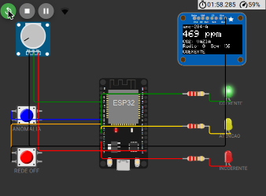
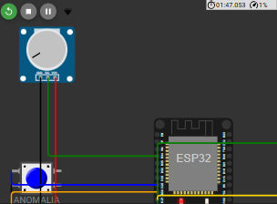
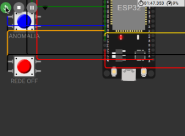
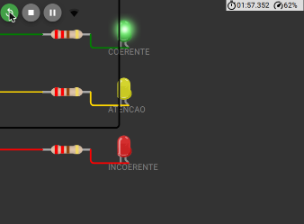
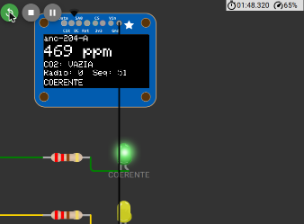

# Guia completo do Marco 2 — para estudar e apresentar

Este documento explica **tudo** o que existe na pasta `marco-02`: cada diretório, cada
arquivo, cada componente do circuito, o que faz, como faz, com quem se conecta e por quê.

Projeto no Wokwi: https://wokwi.com/projects/476001394839038977

---

# Parte 1 — O que é este protótipo, em uma página

## A pergunta que ele responde

O sistema **Presença** mede permanência de estudantes por rádio (Wi-Fi/BLE). Existe uma
fraude que **nenhuma defesa de rádio consegue pegar**: a turma inteira deixa os celulares
na sala e vai embora. Os aparelhos estão genuinamente ali — trilateração, token rotativo,
assinatura criptográfica, tudo confirma. O rádio não tem como saber que não há ninguém.

Este protótipo resolve isso com **física**: pessoas respiram e produzem CO₂. Se o rádio
declara 30 estudantes e o CO₂ diz que a sala está vazia, alguém está mentindo — e o ar
não mente.

## Os dois componentes e a fronteira entre eles

```
┌─────────────────────────┐                     ┌──────────────────────────┐
│   PRODUTOR              │   MQTT sobre TCP    │   CONSUMIDOR             │
│   Âncora da sala        │ ──────────────────▶ │   Gateway do prédio      │
│   ESP32 (Wokwi)         │  sala.ambiente.v1   │   Python (notebook)      │
│                         │                     │                          │
│   Lê CO₂, valida,       │ ◀────────────────── │   Valida, deduplica,     │
│   decide, atua          │ gateway.contagem.v1 │   detecta anomalias,     │
└─────────────────────────┘                     │   alerta                 │
                                                └──────────────────────────┘
```

A **fronteira** exigida pelo Marco 2 é essa seta dupla: dois componentes reais, de
linguagens e máquinas diferentes, conversando por um protocolo com contrato versionado.

---

# Parte 2 — Mapa dos diretórios e arquivos

```
marco-02/
├── README.md              ← documentação da fronteira (a entrega do Marco 2)
├── GUIA.md                ← este arquivo
│
├── contrato/              ← O IDIOMA que os dois componentes falam
│   └── v1/                    a pasta "v1" é a versão do contrato
│       ├── sala.ambiente.v1.schema.json
│       ├── gateway.contagem.v1.schema.json
│       └── exemplos/
│           ├── ambiente-coerente.json
│           ├── ambiente-incoerente.json
│           ├── ambiente-bufferizado.json
│           └── contagem-comando.json
│
├── produtor/              ← O QUE RODA NO ESP32 (dentro do Wokwi)
│   ├── sketch.ino             o programa em C++
│   ├── diagram.json           a descrição do circuito
│   └── libraries.txt          as bibliotecas necessárias
│
├── consumidor/            ← O QUE RODA NO SEU NOTEBOOK
│   ├── consumidor.py          o programa em Python
│   ├── requirements.txt       as dependências
│   ├── config.exemplo.json    modelo de configuração
│   └── .gitignore             o que não vai para o repositório
│
└── evidencias/            ← IMAGENS
    └── componentes/           fotos de cada peça do circuito
```

## 2.1 — `contrato/` — por que existe uma pasta só para isso

Esta é a pasta mais importante conceitualmente, e a que mais gente esquece.

Quando dois programas diferentes conversam, eles precisam concordar **antes** sobre o
formato das mensagens. Se o ESP32 mandar `"valor"` e o Python esperar `"value"`, nada
funciona — e o erro só aparece em execução.

O contrato resolve isso sendo um **arquivo**, não um acordo verbal:

| Arquivo | O que é | Quem usa |
|---|---|---|
| `sala.ambiente.v1.schema.json` | Descrição formal (JSON Schema) do evento que o ESP32 produz: quais campos existem, de que tipo, em que faixa, obrigatórios ou não | O consumidor **lê este arquivo em tempo de execução** e valida cada mensagem contra ele |
| `gateway.contagem.v1.schema.json` | Mesma coisa para o comando que o gateway envia de volta | Documentação; o ESP32 valida de forma simplificada, por limitação de memória |
| `exemplos/*.json` | Instâncias válidas, uma por situação | Para você entender e para testar sem ligar nada |

**Por que `v1` é uma pasta e faz parte do nome do tipo?** Porque o dia em que você
precisar mudar o formato de um jeito incompatível, cria-se `sala.ambiente.v2` e a `v1`
continua existindo. Os dispositivos antigos continuam funcionando enquanto migram. Se a
versão não estivesse no nome, você quebraria todo mundo de uma vez.

## 2.2 — `produtor/` — os três arquivos que o Wokwi precisa

| Arquivo | O que é |
|---|---|
| `sketch.ino` | O programa. C++ para Arduino/ESP32. É ele que lê o sensor, aplica a regra e publica |
| `diagram.json` | O **circuito descrito em texto**. Diz quais peças existem, onde ficam na tela e quais fios ligam o quê. O Wokwi desenha a partir deste arquivo |
| `libraries.txt` | Lista das bibliotecas externas: `PubSubClient` (MQTT), `Adafruit GFX Library` e `Adafruit SSD1306` (display) |

Esses três arquivos **são** o projeto do Wokwi. Se você abrir um Wokwi novo e colar os
três, tem o protótipo inteiro de volta. São também três dos arquivos exigidos no ZIP da
Atividade 03.

## 2.3 — `consumidor/` — o outro lado da fronteira

| Arquivo | O que é |
|---|---|
| `consumidor.py` | O gateway. Conecta no broker, recebe, valida, deduplica, detecta anomalias, alerta e publica a contagem de volta |
| `requirements.txt` | `paho-mqtt` (cliente MQTT) e `jsonschema` (validação contra o contrato) |
| `config.exemplo.json` | Modelo de configuração: endereço do broker, tópicos, intervalos. Você copia para `config.json` e ajusta |
| `.gitignore` | Impede que `config.json`, `recebidos.log` e bytecode entrem no repositório |

**Por que `config.exemplo.json` e não `config.json` direto?** Porque o `config.json` é
*seu* — pode ter um broker diferente, um tópico diferente. O exemplo fica versionado como
modelo; o real fica fora do repositório. É prática padrão.

## 2.4 — Arquivos gerados em execução (não versionados)

| Arquivo | Quando aparece |
|---|---|
| `config.json` | Quando você copia o exemplo |
| `recebidos.log` | Toda execução do consumidor. Uma linha JSON por evento, com o carimbo de recepção e a classificação (aceito, duplicado, fora de ordem…). **É a sua evidência de que funcionou** |

---

# Parte 3 — O circuito, peça por peça

## Visão geral



Sete tipos de peça, onze componentes no total. Cada um tem um papel no ciclo exigido pela
Atividade 03: **fenômeno → sensor → validação → evento → estado → decisão → atuação**.

| Peça | Papel no ciclo | Pino do ESP32 |
|---|---|---|
| Potenciômetro | Entrada — representa o CO₂ | `GPIO34` |
| Botão azul | Entrada — injeta anomalia de sequência | `GPIO25` |
| Botão vermelho | Entrada — simula queda de rede | `GPIO26` |
| LED verde | Atuação — estado COERENTE | `GPIO14` |
| LED amarelo | Atuação — estado ATENÇÃO | `GPIO27` |
| LED vermelho | Atuação — estado INCOERENTE | `GPIO13` |
| Display OLED | Atuação — mostra tudo | `GPIO21` (SDA) e `GPIO22` (SCL) |
| 3 resistores | Proteção dos LEDs | — |

---

## 3.1 — Potenciômetro — a entrada de CO₂



### O que é fisicamente

Um **divisor de tensão variável**. Tem três pinos:

| Pino | Ligado em | Função |
|---|---|---|
| `VCC` | `3V3` do ESP32 | Tensão de referência, 3,3 V |
| `GND` | `GND` do ESP32 | Terra, 0 V |
| `SIG` | `GPIO34` | Saída — a tensão que varia conforme você gira o botão |

Girando o botão, a tensão em `SIG` varia continuamente entre 0 V e 3,3 V.

### O que ele representa aqui

**A concentração de CO₂ da sala, em ppm.** E isto precisa ser dito com todas as letras na
apresentação, porque o enunciado exige:

> **Não é um sensor de CO₂.** Não há aquisição de grandeza física real, não há calibração,
> não há resposta química. É apenas uma fonte de valor controlável, que eu declaro estar
> representando CO₂ na faixa de 380 a 2200 ppm.

O enunciado autoriza explicitamente ("Sensor indisponível → Potenciômetro"), desde que a
substituição seja declarada. Escolhi potenciômetro em vez do sensor MQ2 por dois motivos:
o próprio enunciado avisa que o MQ2 não deve ser tratado como medidor de CO₂, e o
potenciômetro me dá controle preciso para a demonstração.

### Como o código lê

```cpp
const int PINO_POT = 34;

float lerPpmBruto() {
  int cru = analogRead(PINO_POT);            // 0..4095 (ADC de 12 bits)
  return 380.0 + (cru / 4095.0) * (2200.0 - 380.0);
}
```

O ADC do ESP32 tem **12 bits**, então devolve um inteiro de 0 a 4095. A conta converte
essa escala para a faixa de ppm que declarei representar.

### Por que o GPIO34 especificamente

Porque no ESP32 o **GPIO34 é entrada analógica do ADC1 e é somente-entrada**. Os pinos do
ADC2 não funcionam quando o Wi-Fi está ligado — e este projeto vive de Wi-Fi. Usar um
pino do ADC2 seria um bug silencioso: leituras zeradas assim que o rádio subisse.

> **Se o professor perguntar "por que esse pino?"**, esta é a resposta: ADC1 porque o
> ADC2 conflita com o Wi-Fi.

---

## 3.2 — Os dois botões — as condições de falha



### Como estão ligados

Cada botão tem um lado no pino do ESP32 e o outro no `GND`. Não há resistor externo
porque o código usa o **resistor de pull-up interno** do chip:

```cpp
pinMode(PINO_BTN_ANOMALIA, INPUT_PULLUP);
pinMode(PINO_BTN_REDE,     INPUT_PULLUP);
```

Consequência importante para entender o código: **o pino lê `HIGH` quando o botão está
solto e `LOW` quando está pressionado**. É invertido em relação à intuição. Solto, o
pull-up interno puxa o pino para 3,3 V; pressionado, o botão liga o pino ao terra.

### Botão azul — ANOMALIA (`GPIO25`)

Cada aperto **arma** uma anomalia, aplicada na publicação seguinte, ciclando entre três:

| Aperto | Anomalia | O que o ESP32 faz |
|---|---|---|
| 1º | `duplicata` | Publica de novo com a **mesma** sequência anterior |
| 2º | `fora-de-ordem` | Publica com uma sequência **3 números atrás** |
| 3º | `salto` | **Pula 5 números** na sequência |
| 4º | volta para `duplicata` | … e recomeça o ciclo |

Este é o **teste adversarial obrigatório** da Atividade 03 para matrícula terminada em
**8**: *evento repetido, fora de ordem ou com salto na sequência*.

### Botão vermelho — REDE OFF (`GPIO26`)

Alterna entre rede disponível e indisponível. Com a rede fora, o ESP32:

1. **continua amostrando e decidindo** — o sensoriamento não para;
2. guarda os eventos numa fila local de 20 posições;
3. preserva o `eventTimeMs` **original** de cada um.

Ao apertar de novo, drena a fila marcando `bufferizado: true`. O gateway recebe eventos
atrasados, não eventos novos — e recalcula.

### Debounce — por que existe esse código

```cpp
const unsigned long DEBOUNCE = 50;
if (bAnom != ultAnom && agora - tAnom > DEBOUNCE) { ... }
```

Um botão físico não fecha o contato de forma limpa: nos primeiros milissegundos ele
"treme" e gera dezenas de transições. Sem debounce, um aperto viraria cinco anomalias
armadas. O código só aceita uma mudança de estado se tiverem passado 50 ms desde a
última.

> Esse é um exemplo concreto de **decisão que não é comparação instantânea**, que a
> Atividade 03 exige no item 5.3.

---

## 3.3 — Os três LEDs e os resistores — a atuação



### Como estão ligados

Cada LED segue o mesmo caminho:

```
GPIO do ESP32  →  resistor de 220 Ω  →  perna longa do LED (ânodo, A)
                                        perna curta do LED (cátodo, C)  →  GND
```

| LED | Pino | Significa |
|---|---|---|
| 🟢 Verde | `GPIO14` | `COERENTE` — CO₂ e contagem do rádio concordam |
| 🟡 Amarelo | `GPIO27` | `ATENCAO` — dados insuficientes, leitura inválida ou suspeita ainda não confirmada |
| 🔴 Vermelho | `GPIO13` | `INCOERENTE` — o rádio declara ocupação que o CO₂ não sustenta |

### Por que o resistor de 220 Ω

Um LED é um diodo: se ligado direto, ele conduz corrente sem limite e queima — e pode
levar junto o pino do ESP32. O resistor limita a corrente:

```
I = (3,3 V − 2,0 V) / 220 Ω ≈ 6 mA
```

Confortavelmente abaixo dos 40 mA que o pino suporta, e suficiente para o LED acender.

### Por que GPIO13 e não GPIO12

Detalhe que vale saber: o **GPIO12 é um pino de strapping** no ESP32 (MTDI). Se estiver
em nível alto no momento do boot, o chip tenta configurar a tensão da memória flash e
pode não inicializar. GPIO13 não tem essa função, então é seguro.

### Comportamento seguro

Repare que só um LED acende por vez, e que o estado `ATENCAO` existe justamente para
**não acusar ninguém** quando os dados não permitem. O sistema prefere dizer "não sei" a
dizer "estão fraudando".

---

## 3.4 — Display OLED — a observabilidade



### O que é e como se liga

Um display **SSD1306**, 128×64 pixels, monocromático. Comunica por **I²C**, um barramento
de dois fios:

| Pino | Ligado em | Função |
|---|---|---|
| `VCC` | `3V3` | Alimentação |
| `GND` | `GND` | Terra |
| `SDA` | `GPIO21` | *Serial Data* — os dados |
| `SCL` | `GPIO22` | *Serial Clock* — o relógio que sincroniza |

GPIO21 e GPIO22 são os pinos de I²C padrão do ESP32. O display responde no endereço
`0x3C`.

### O que ele mostra

Na foto acima, lendo linha por linha:

```
anc-204-A              ← identificação da âncora (deviceId)
469 ppm                ← CO₂ filtrado pela média móvel
CO2: VAZIA             ← ocupação inferida só pelo CO₂
Radio: 0  Seq: 51      ← contagem declarada pelo gateway e nº do evento
COERENTE               ← estado final da verificação cruzada
```

**Entenda esta tela, porque ela é a sua melhor ferramenta na apresentação.** O estado é
`COERENTE` mesmo com a sala vazia porque o rádio está declarando **zero** estudantes —
não há contradição nenhuma entre "não tem ninguém" e "o rádio não vê ninguém". A
incoerência só aparece quando o rádio declara 10 ou mais **e** o CO₂ diz vazia.

### Degradação se o display falhar

```cpp
temDisplay = display.begin(SSD1306_SWITCHCAPVCC, 0x3C);
```

O código guarda se a inicialização deu certo e só desenha se `temDisplay` for verdadeiro.
Se o display estiver ausente ou com defeito, o resto do sistema continua funcionando — o
programa não trava. É uma decisão de projeto, não um acaso.

---

## 3.5 — O ESP32 — o cérebro

O ESP32 DevKit V1 é o microcontrolador. O que importa saber dele aqui:

| Característica | Por que importa neste projeto |
|---|---|
| **Dois núcleos, 240 MHz** | Sobra folga para o filtro e o MQTT rodarem juntos |
| **Wi-Fi integrado** | É o que permite falar MQTT sem hardware adicional |
| **ADC de 12 bits** | Lê o potenciômetro com 4096 níveis |
| **ADC2 inutilizável com Wi-Fi ligado** | Por isso o potenciômetro está no GPIO34 (ADC1) |
| **Pinos de strapping (0, 2, 12, 15)** | Evitados para não atrapalhar o boot |
| **`millis()` desde o boot** | Não há relógio de tempo real: por isso `eventTimeMs` não é tempo absoluto |

No Wokwi, o ESP32 conecta na rede virtual `Wokwi-GUEST`, que tem saída real para a
internet. É assim que ele alcança o broker MQTT público.

---

# Parte 4 — Como o programa do ESP32 funciona

O `sketch.ino` tem cerca de 530 linhas, organizadas em blocos. Percorrendo na ordem em
que os dados atravessam o programa:

## 4.1 — Amostragem e validação (a cada 400 ms)

```cpp
bool amostrar() {
  float bruto = lerPpmBruto();

  // Rejeição 1: fora da faixa física do sensor
  if (bruto < 350.0 || bruto > 5000.0) { amostrasInvalidas++; return false; }

  // Rejeição 2: salto instantâneo implausível
  if (temLeituraValida && fabs(bruto - ppmFiltrado) > 300.0) {
    amostrasInvalidas++; return false;
  }
  ...
}
```

São **duas validações diferentes**, e vale saber distinguir:

- a primeira pega **leitura impossível** — um valor que nenhum sensor real produziria;
- a segunda pega **ruído** — a concentração de um gás num ambiente fechado não muda 300
  ppm em 400 ms; fisicamente não dá tempo. Se mudou, foi interferência elétrica, não gás.

A amostra aceita entra numa **média móvel de 5 posições**, que suaviza o que sobrou de
ruído.

## 4.2 — Camada 1 da regra: ocupação pelo CO₂

Esta camada decide se a sala está `VAZIA`, `OCUPADA` ou `INDETERMINADA`, usando três
mecanismos:

### Histerese — dois limiares, não um

```cpp
const float LIMIAR_OCUPADA = 800.0;   // sobe para OCUPADA acima disso
const float LIMIAR_VAZIA   = 600.0;   // desce para VAZIA abaixo disso
```

Se houvesse um limiar único de 700 ppm, um valor oscilando em torno dele faria o estado
piscar dezenas de vezes por minuto. Com dois limiares, existe uma **faixa morta** entre
600 e 800 onde o estado simplesmente não muda. É o mesmo princípio do termostato.

### Persistência — a condição tem que se sustentar

```cpp
const unsigned long PERSIST_OCUPADA = 6000;   // 6 segundos
const unsigned long PERSIST_VAZIA   = 8000;   // 8 segundos
```

Não basta cruzar o limiar: é preciso **permanecer** do outro lado por alguns segundos. O
código acumula o tempo enquanto a condição vale e zera assim que ela se quebra.

### Validade — o dado expira

```cpp
if (!temLeituraValida || (agora - ultimaLeituraValidaMs) > VALIDADE_LEITURA) {
  ocupacao = OCUP_INDETERMINADA;
}
```

Se passarem 10 segundos sem nenhuma leitura válida, a ocupação volta para
`INDETERMINADA`. O sistema **esquece** o que sabia, em vez de continuar decidindo com
base em dado velho.

## 4.3 — Camada 2 da regra: a verificação cruzada

```cpp
bool condicaoSuspeita = (contagemRadio >= 10) && (ocupacao == OCUP_VAZIA);
```

Aqui estão as **duas entradas combinadas** — o CO₂ (do sensor local) e a contagem do
rádio (que chega pelo MQTT, vinda do gateway). Nenhuma das duas sozinha decide nada.

E a suspeita ainda precisa **persistir por 10 segundos** antes de virar acusação. Antes
disso, o estado é `ATENCAO`, não `INCOERENTE`.

### Rearme — evitando oscilação na atuação

```cpp
if (novo != estado) {
  if (agora - ultimaMudancaEstado < TEMPO_MINIMO_ESTADO) return;  // 3 s
  ...
}
```

Mesmo depois de tudo isso, o estado não pode mudar mais de uma vez a cada 3 segundos.
Isso atende ao item da Atividade 03 que pede "prevenção de comandos repetidos ou
oscilação".

## 4.4 — Montagem e publicação do evento

O evento é montado com `snprintf` (sem biblioteca de JSON, para economizar memória) e
enviado para **dois lugares ao mesmo tempo**:

1. `Serial.println(buf)` — o monitor serial, que é o requisito 5.2 da Atividade 03;
2. `mqtt.publish(...)` — o broker, que é a fronteira do Marco 2.

Um detalhe importante da configuração:

```cpp
mqtt.setBufferSize(512);   // o padrão do PubSubClient é 256 bytes
```

Sem essa linha, o `publish` falha silenciosamente para payloads maiores que 256 bytes — e
o nosso passa disso. É o tipo de erro que consome uma tarde inteira.

## 4.5 — Recebimento do comando

```cpp
void aoReceberComando(char* topico, byte* carga, unsigned int tamanho) {
  ...
  if (cmdId.length() > 0 && cmdId == ultimoComandoId) {
    Serial.printf("[COMANDO] %s ja aplicado, ignorado\n", cmdId.c_str());
    return;   // IDEMPOTÊNCIA
  }
  ...
}
```

O MQTT com QoS 1 garante entrega **ao menos uma vez** — o que significa que a mesma
mensagem pode chegar duas vezes. Guardando o último `commandId` aplicado, uma reentrega
não altera o estado. Isso se chama **idempotência** e é o mesmo princípio que o
consumidor usa com o `eventId`.

---

# Parte 5 — Como o consumidor funciona

## 5.1 — Validação contra o contrato

```python
from jsonschema import Draft202012Validator

class Validador:
    def validar(self, dado):
        if dado.get("eventType") != "sala.ambiente.v1":
            return False, f"eventType inesperado"
        erros = sorted(self.validador.iter_errors(dado), ...)
```

Repare que ele **lê o arquivo de schema do disco** e valida contra ele. O contrato não é
decorativo: se você acrescentar um campo ao evento no ESP32, o consumidor **rejeita** a
mensagem, porque o schema diz `additionalProperties: false`.

> Essa é a melhor "pequena alteração ao vivo" para a apresentação: acrescente um campo,
> mostre a rejeição, e então versione para `v2`.

## 5.2 — As três detecções de anomalia

Esta é a parte que corresponde à sua responsabilidade individual declarada
(**comunicação e resiliência**) e ao teste adversarial da sua matrícula:

| Detecção | Como funciona | O que o consumidor faz |
|---|---|---|
| **Duplicata** | `eventId` já está no dicionário `vistos` | Descarta sem alterar o estado |
| **Fora de ordem** | `sequence` menor que `maior_sequencia` | Aceita e registra, mas **não retrocede** o estado |
| **Salto** | `sequence > maior_sequencia + 1` | Conta quantos eventos faltaram e sinaliza |

O dicionário `vistos` é um `OrderedDict` com limite de 500 entradas, descartando as mais
antigas. Sem esse limite, um sistema rodando por semanas consumiria memória sem parar.

**Detalhe que vale destacar:** o consumidor **não usa** o campo `anomaliaInjetada` para
detectar nada. Ele detecta pela sequência, exatamente como faria em produção. O campo
existe só para deixar a demonstração legível.

## 5.3 — O carimbo de tempo autoritativo

```python
def _ao_receber(self, cliente, userdata, msg):
    recebido_em = datetime.now(timezone.utc)   # CARIMBO AUTORITATIVO
```

O `eventTimeMs` que vem do ESP32 é tempo **desde o boot**, não tempo absoluto — e o
relógio de um dispositivo em campo não é confiável de qualquer forma. O tempo que vale
para o registro é o do gateway, aplicado no instante da recepção.

## 5.4 — O comando de volta

A cada 10 segundos o consumidor publica a contagem declarada pelo rádio. É isso que
fecha o laço: **o ESP32 não teria como fazer a verificação cruzada sem esse dado**, porque
ele não tem acesso ao subsistema de rádio.

Durante a execução você pode digitar um número no terminal para mudar a contagem — é
assim que se provoca o estado `INCOERENTE` na demonstração.

---

# Parte 6 — Rastreando um evento de ponta a ponta

Vale decorar esta sequência. É a resposta para "explique como funciona".

```
 1. Você gira o potenciômetro para 470 ppm
 2. A cada 400 ms o ESP32 lê o ADC:  analogRead(34) → 0..4095 → 470 ppm
 3. Valida: está entre 350 e 5000?  sim
             saltou mais de 300 ppm? não
 4. Entra na média móvel de 5 amostras → ppmFiltrado = 469
 5. 469 < 600, e isso se sustenta por 8 s → ocupacao = VAZIA
 6. O gateway havia publicado contagem = 25 → contagemRadio = 25
 7. 25 >= 10  E  ocupacao == VAZIA  →  condição suspeita
 8. A condição persiste 10 s → estado = INCOERENTE
 9. ATUAÇÃO LOCAL: apaga o LED verde, acende o vermelho, atualiza o OLED
10. A cada 2 s monta o JSON:
    {"eventType":"sala.ambiente.v1","eventId":"anc-204-A#63",...,"state":"INCOERENTE"}
11. Escreve no monitor serial  +  publica no tópico MQTT
12. O broker entrega ao consumidor
13. O consumidor valida contra o schema  →  ok
14. Verifica o eventId em "vistos"       →  novo
15. Verifica a sequência                 →  sem salto
16. Carimba o horário de recepção
17. Detecta a mudança para INCOERENTE    →  ATUAÇÃO REMOTA: alerta na tela
18. Grava a linha em recebidos.log
```

---

# Parte 7 — Perguntas prováveis e respostas

**"Por que o potenciômetro e não um sensor de verdade?"**
Porque o Wokwi não simula química de gás, e o enunciado autoriza a substituição desde que
declarada. O que estou validando é a **lógica de estado, o contrato e a resiliência** —
não a aquisição do sinal. Isso está escrito no cabeçalho do código e na seção 8 do README.

**"O que acontece se chegarem dois eventos iguais?"**
O consumidor descarta o segundo, porque o `eventId` já está no conjunto de vistos. O
estado não muda. Posso demonstrar agora apertando o botão azul.

**"E se um evento chegar fora de ordem?"**
É aceito e registrado, mas não retrocede o estado. Retroceder seria pior que ignorar —
significaria voltar para uma leitura que já sei estar desatualizada.

**"Por que a regra não é só `if (co2 < 600)`?"**
Porque um valor instantâneo oscila e geraria acusações falsas. A regra usa histerese de
dois limiares, persistência de 6 a 10 segundos, média móvel de 5 amostras, expiração do
dado após 10 segundos e um tempo mínimo de 3 segundos entre mudanças de estado.

**"Onde está o estado guardado?"**
Em três lugares, cada um com um motivo. No ESP32: a janela da média, os acumuladores de
tempo e a fila de eventos não enviados. No consumidor: o conjunto de `eventId` vistos, a
maior sequência e os contadores. No contrato: nada — contrato não guarda estado, ele
descreve formato.

**"O que acontece se a rede cair no meio da aula?"**
O ESP32 continua amostrando e decidindo, e guarda os eventos numa fila de 20 posições com
o horário original preservado. Quando volta, drena a fila marcando `bufferizado: true`, e
o consumidor os trata como eventos atrasados, não como novos. Se a fila encher, descarta
o mais antigo **e registra o descarte** — assim o intervalo aparece como incompleto em
vez de silenciosamente vazio.

**"Isso escala para um prédio inteiro?"**
O volume é de cerca de meio evento por segundo por sala. Sessenta salas dão 30 eventos
por segundo, o que qualquer broker aguenta. O gargalo não é o dado, é o número de
conexões Wi-Fi — e é por isso que, no projeto completo, as três âncoras de cada sala
formam uma malha ESP-NOW e só a líder fala com o gateway.

---

# Parte 8 — O que testar antes da apresentação

| Teste | Como fazer | O que tem que acontecer |
|---|---|---|
| **Normal** | Consumidor com contagem 0, potenciômetro em qualquer posição | LED verde, `state: COERENTE`, eventos fluindo com sequência crescente |
| **Decisão e atuação** | Digite `25` no consumidor e gire o potenciômetro para o mínimo | Após ~10 s: LED vermelho, `INCOERENTE`, **alerta** no terminal do consumidor |
| **Adversarial** | Aperte o botão azul três vezes, com alguns segundos entre elas | Consumidor mostra `DUPLICADO`, depois `FORA DE ORDEM`, depois `SALTO` com a contagem de eventos perdidos |
| **Falha de rede** | Aperte o botão vermelho, espere ~20 s, aperte de novo | Serial mostra eventos sendo retidos; ao voltar, o consumidor mostra várias linhas `ATRASADO` |

Capture a tela de cada um — são as evidências exigidas no ZIP da Atividade 03.

> **Atenção para o dia:** mantenha a aba do Wokwi em primeiro plano. Quando ela vai para
> segundo plano, o navegador reduz a simulação a cerca de 1% da velocidade e o relógio
> praticamente para.
