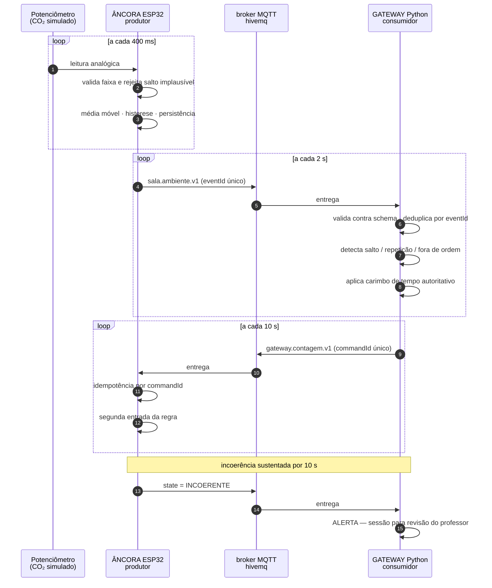

# Marco 2 — fronteira de comunicação âncora ↔ gateway

Integração real entre dois componentes do sistema **Presença**: a âncora da sala
(ESP32) publica eventos de ambiente, e o gateway consome, valida e devolve um comando
que alimenta a regra executada na âncora.

**Projeto no Wokwi:** https://wokwi.com/projects/476001394839038977

| | |
|---|---|
| **Produtor** | Âncora de sala — ESP32 no Wokwi ([`produtor/`](produtor/)) |
| **Comunicação** | MQTT sobre TCP, broker público `broker.hivemq.com:1883` |
| **Consumidor** | Gateway da sala — Python ([`consumidor/`](consumidor/)) |
| **Contrato** | [`contrato/v1/`](contrato/v1/) — `sala.ambiente.v1` e `gateway.contagem.v1` |

---

## 1. O que esta fronteira resolve

O sistema Presença mede permanência de estudantes por rádio. A fraude que **nenhuma
defesa de rádio alcança** é o conluio em massa: a turma deixa os celulares na sala e vai
embora. Os aparelhos estão genuinamente ali, e trilateração, token rotativo e assinatura
confirmam todos.

Esta âncora confere a contagem do rádio contra a **física do ar**. Gente na sala produz
CO₂. Se o rádio declara 30 estudantes e o CO₂ diz sala vazia, alguém mente — e ar não
mente.

## 2. Fluxo de comunicação



## 3. Responsabilidades

| Componente | Faz | Não faz |
|---|---|---|
| **Âncora (ESP32)** | Lê, valida faixa, filtra ruído, mantém histerese e persistência, decide o estado local, atua em LEDs e display, retém eventos quando a rede cai | Não conhece estudantes, não guarda identidade, não decide frequência |
| **Gateway (Python)** | Valida contra o contrato versionado, deduplica, detecta anomalias de sequência, carimba o tempo autoritativo, alerta, declara a contagem do rádio | Não lê sensor, não decide sozinho o estado da sala |

**Decisão:** a âncora decide o estado **local** (coerente/incoerente) porque a decisão
depende de histórico de segundos que não vale a pena trafegar. O gateway decide o que
fazer com esse estado, porque isso depende de contexto que a âncora não tem — turma,
horário, histórico do semestre.

**Decisão:** o carimbo de tempo autoritativo é o do gateway. O `eventTimeMs` do ESP32 é
tempo desde o boot, não tempo absoluto, e o relógio do dispositivo não é confiável.

## 4. Contrato

Versionado no próprio nome do tipo: `sala.ambiente.v1`. Mudança incompatível cria a
`v2`; o consumidor rejeita o que não reconhece em vez de adivinhar.

Campos obrigatórios (contrato mínimo da Atividade 03, mais os específicos):

```json
{
  "eventType": "sala.ambiente.v1",
  "eventId": "anc-204-A#63",
  "deviceId": "anc-204-A",
  "entityId": "sala-204",
  "eventTimeMs": 97310,
  "sequence": 63,
  "value": 468.1,
  "unit": "ppm",
  "state": "INCOERENTE",
  "ocupacaoCo2": "VAZIA",
  "contagemRadio": 31,
  "amostrasInvalidas": 2,
  "bufferizado": false
}
```

`eventId` = `deviceId#sequence` é a **identificação única** exigida na apresentação, e é
a chave de deduplicação no consumidor.

Schemas completos e mais exemplos em [`contrato/v1/`](contrato/v1/).

## 5. Condições de falha exercitadas

Dois botões no circuito disparam as falhas ao vivo:

### Botão azul — ANOMALIA DE SEQUÊNCIA

Cada aperto arma uma anomalia, aplicada na publicação seguinte, ciclando entre:

| Anomalia | O que a âncora faz | O que o gateway detecta |
|---|---|---|
| **Duplicata** | Repete a sequência anterior | `eventId` já processado → descarta sem efeito no estado |
| **Fora de ordem** | Envia uma sequência 3 números atrás | `sequence` menor que a maior vista → aceita, mas não retrocede o estado |
| **Salto** | Pula 5 números | Lacuna → conta os eventos perdidos e sinaliza |

> Este é o **teste adversarial obrigatório** da Atividade 03 para matrícula terminada em
> **8**: evento repetido, fora de ordem ou com salto na sequência.

O consumidor **não usa** o campo `anomaliaInjetada` para detectar nada — ele detecta pela
sequência, exatamente como faria em produção. O campo existe só para tornar a
demonstração legível.

### Botão vermelho — QUEDA DE REDE

Alterna a disponibilidade da rede. Com a rede fora, a âncora **continua amostrando** e
retém os eventos numa fila local de 20 posições, preservando o `eventTimeMs` original.
Ao restabelecer, drena a fila com `bufferizado: true` — o gateway recebe eventos
atrasados e recalcula, em vez de tratá-los como novos.

Se a fila encher, descarta o **mais antigo** e registra o descarte, para que o intervalo
apareça como incompleto em vez de silenciosamente vazio.

## 6. Como executar

### Produtor (Wokwi)

1. Abra https://wokwi.com/projects/476001394839038977
2. Clique no botão verde de play. Bibliotecas: `PubSubClient`, `Adafruit GFX Library`,
   `Adafruit SSD1306` (já declaradas em [`produtor/libraries.txt`](produtor/libraries.txt)).
3. **Mantenha a aba em primeiro plano** — o Wokwi estrangula a simulação quando a aba
   fica em segundo plano, e o relógio simulado praticamente para.

### Consumidor (local)

```bash
cd marco-02/consumidor
pip install -r requirements.txt
cp config.exemplo.json config.json      # ajuste se quiser
python consumidor.py
```

Durante a execução, digite no terminal:

| Tecla | Efeito |
|---|---|
| `<número>` | Define a contagem de estudantes declarada pelo rádio |
| `p` | Mostra o painel de contadores |
| `r` | Reinicia os contadores da sessão |
| `q` | Encerra |

Os eventos recebidos são gravados em `recebidos.log`, com o carimbo de recepção e a
classificação de cada um.

### ⚠️ Restrição de rede verificada

A porta **1883 está bloqueada na rede da faculdade** (testado: `broker.hivemq.com`,
`broker.emqx.io` e `test.mosquitto.org` todos com timeout, enquanto a 443 passa
normalmente). O ESP32 não sofre com isso, porque roda na infraestrutura do Wokwi — mas
**o consumidor rodando no notebook não conecta de dentro do campus**.

Antes da apresentação é preciso decidir entre:

1. usar rede móvel no notebook durante a demonstração;
2. trocar o transporte para **MQTT sobre WebSocket seguro**, que trafega em porta
   liberada — muda poucas linhas nos dois lados;
3. subir um broker local (`mosquitto`) e apontar os dois componentes para ele, o que
   dispensa internet mas exige o ESP32 alcançando a máquina, o que o Wokwi não faz.

A opção 2 é a mais robusta e é a recomendada.

## 7. Roteiro da apresentação

| # | Item exigido | Como demonstrar |
|---|---|---|
| 1 | Contextualizar produtor, comunicação e consumidor | Seção 2 deste README |
| 2 | Executar a troca ao vivo | Play no Wokwi + `python consumidor.py` |
| 3 | Evento com identificação única | Apontar o `eventId` no serial e no consumidor |
| 4 | Efeito no consumidor | Girar o potenciômetro para baixo com contagem ≥ 10 → LED vermelho na âncora e **ALERTA DE INCOERÊNCIA** no gateway |
| 5 | Condição de falha ou retry | Botão azul (anomalia de sequência) e botão vermelho (queda de rede com reentrega) |
| 6 | Decisões arquiteturais | Seções 3 e 4 |
| 7 | Alteração ao vivo | Ver abaixo |

### Alterações fáceis de fazer ao vivo

Prepare-se para qualquer uma destas — todas são de uma linha:

- mudar `LIMIAR_OCUPADA` de 800 para outro valor e mostrar a histerese reagindo;
- mudar `PERSIST_INCOERENCIA` e mostrar que a acusação demora mais ou menos;
- mudar `CONTAGEM_SUSPEITA` e mostrar a regra disparando com menos estudantes;
- acrescentar um campo ao evento e mostrar o consumidor **rejeitando** por
  `additionalProperties: false` — e então versionar para `v2`.

A última é a mais interessante, porque demonstra que o contrato está sendo validado de
verdade e não apenas documentado.

## 8. O que foi validado e o que não foi

| Validado no simulador | Exigiria hardware e ambiente reais |
|---|---|
| Lógica de estado, histerese, persistência e expiração | Resposta química de um sensor de CO₂ real, com tempo de difusão e deriva |
| Contrato, sequência, deduplicação e detecção de anomalias | Comportamento do broker sob perda real de pacotes |
| Retenção local e reentrega com atraso | Fila sobrevivendo a reinício do dispositivo (aqui ela é volátil) |
| Atuação em LEDs e display | Calibração do sensor e correlação real entre ppm e número de pessoas |

**O potenciômetro não é um sensor de CO₂.** Não houve aquisição nem validação de
grandeza física real: não há sensor de gás, calibração ou resposta química. Ele é apenas
uma fonte de valor controlável na faixa de 380 a 2200 ppm.

**`eventTimeMs` não é tempo absoluto** — é tempo desde o início da simulação, porque o
ESP32 não tem relógio sincronizado neste protótipo. O carimbo autoritativo é aplicado
pelo consumidor na recepção.
